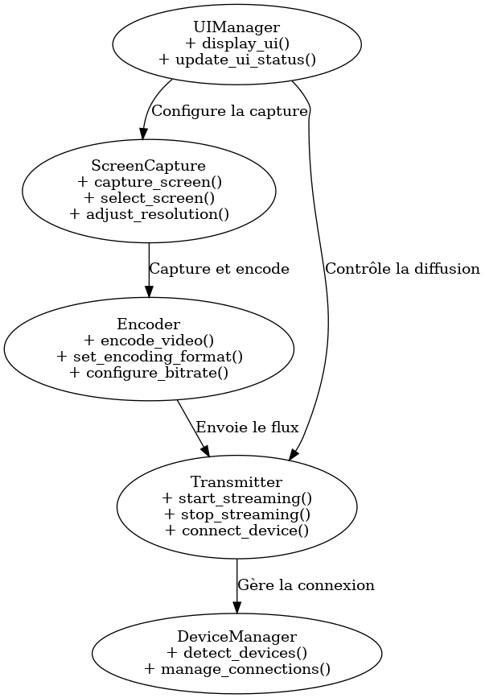

# Logiciel de Castage d'Écran en Rust

## 1. Introduction
Ce projet est une application de bureau permettant le partage d'écran avec des télévisions et autres appareils compatibles via diverses technologies de cast.

## 2. Mermelade du Projet

### 2.1 Architecture du Projet
Le projet est basé sur plusieurs modules interconnectés :
- **ScreenCapture** : Capture l'écran et gère l'affichage en temps réel.
- **Encoder** : Convertit les images capturées en un flux vidéo.
- **Transmitter** : Transmet le flux vidéo aux dispositifs de destination.
- **UIManager** : Interface utilisateur permettant de configurer et de contrôler la diffusion.
- **DeviceManager** : Détecte les appareils compatibles et gère les connexions.

### 2.2 Diagramme des Classes
```plaintext
+----------------+       +------------+       +--------------+
| ScreenCapture | ----> | Encoder    | ----> | Transmitter  |
+----------------+       +------------+       +--------------+
        |                         |
        V                         V
+----------------+       +--------------+
| UIManager      | ----> | DeviceManager |
+----------------+       +--------------+
```


## 3. Fonctions à Implémenter

### 3.1 Capture d'écran
- `capture_screen() -> Image` : Capture l'écran en temps réel.
- `select_screen(screen_id: int)` : Sélectionne l'écran à capturer.
- `adjust_resolution(width: int, height: int)` : Ajuste la résolution.

### 3.2 Encodage Vidéo
- `encode_video(frame: Image) -> Bytes` : Encode l'image en flux vidéo.
- `set_encoding_format(format: str)` : Définit le format d'encodage (H.264, VP9).
- `configure_bitrate(bitrate: int)` : Régule la qualité vidéo.

### 3.3 Transmission du Flux
- `start_streaming(protocol: str)` : Démarre la diffusion.
- `stop_streaming()` : Arrête la transmission.
- `connect_device(device_ip: str)` : Connecte un appareil cible.

### 3.4 Gestion de l'Interface Utilisateur
- `display_ui()` : Affiche l'interface graphique.
- `update_ui_status(message: str)` : Met à jour les informations affichées.

## 4. Techniques Utilisées

### 4.1 Performance et Optimisation
- Utilisation de **Rust Tokio** pour la gestion asynchrone.
- Encodage vidéo via **FFmpeg** pour une faible latence.
- Utilisation de **GPU Acceleration** (via Vulkan ou OpenGL) pour optimiser l'affichage et le traitement vidéo.
- Compression efficace avec **AV1** pour minimiser la bande passante tout en conservant une haute qualité.

### 4.2 Compatibilité et Protocoles
- **WebRTC** pour le streaming web.
- **Chromecast API** pour Google Cast.
- **Miracast** via Wi-Fi Direct pour Smart TV.
- **RTP/RTSP** pour une diffusion ultra-rapide sur les réseaux locaux.

### 4.3 Sécurité et Stabilité du Code
- Utilisation des **Rust Safe API** pour éviter les fuites mémoire.
- Chiffrement des données via **TLS et SRTP** pour protéger la transmission.
- Gestion des erreurs et récupération automatique pour éviter les crashs.

## 5. Interface Graphique

### 5.1 Technologies possibles pour l'UI (axées sur la performance)
1. **Slint** 🖼️ (anciennement SixtyFPS)
   - Avantages : Conçu pour Rust, très performant et léger.
   - Idéal pour une UI native fluide et rapide.

2. **egui** 🎨 (pure Rust, sans dépendance native)
   - Avantages : Simple à utiliser, fonctionne directement en Rust, ultra rapide.
   - Idéal si tu veux une UI légère et rapide sans complexité.

3. **Druid** / **Iced** ☕
   - Avantages : Approche déclarative, inspirée de Flutter, avec un bon compromis entre rapidité et flexibilité.

### 5.2 Choix recommandé
- **Si la performance est la priorité absolue → Slint.**
- **Si tu veux du full Rust sans dépendance externe → egui.**
- **Si tu veux un compromis entre flexibilité et rapidité → Iced.**

## 6. Conclusion
Ce projet vise à fournir une solution ultra-performante pour le partage d'écran en temps réel avec un large éventail d'appareils. En utilisant Rust, des optimisations avancées et des protocoles modernes, il assure un streaming fluide, sécurisé et à faible latence.

