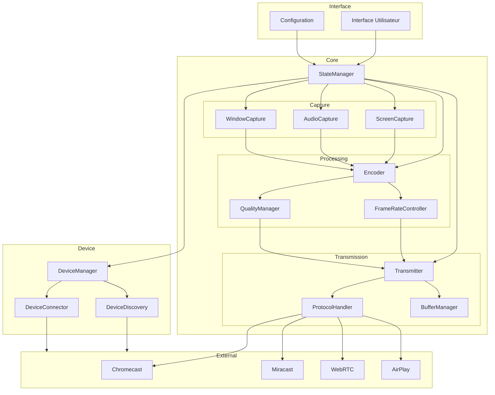

# Architecture proposée pour le logiciel de castage d'écran

## Architecture générale

Je propose une architecture modulaire avec plusieurs couches bien définies qui suivent les principes de séparation des préoccupations:



## Description des composants

### 1. Couche Interface

- **Interface Utilisateur (UIManager)**
  - Responsable de l'affichage et des interactions avec l'utilisateur
  - Implémentée avec Slint pour une performance optimale ou egui pour simplicité
  - Affichage des appareils disponibles, statut de la connexion, qualité du stream

- **Configuration**
  - Gestion des paramètres persistants
  - Format d'encodage préféré, résolution, bitrate
  - Périphériques favoris et leurs paramètres

### 2. Couche Core (Noyau)

- **StateManager**
  - Module central coordonnant tous les autres modules
  - Gère l'état global de l'application
  - Implémente le pattern Observer pour notifier les composants des changements

#### Module Capture

- **ScreenCapture**
  - Capture de l'écran entier à intervalles réguliers
  - Optimisé avec accès direct GPU via Vulkan ou OpenGL
  - Détection des changements pour optimiser les ressources

- **WindowCapture**
  - Capture d'une fenêtre spécifique uniquement
  - Suit les déplacements de fenêtre

- **AudioCapture**
  - Capture audio synchronisée avec la vidéo
  - Sélection de source audio (système, application spécifique)

#### Module Processing

- **Encoder**
  - Conversion des images capturées en flux vidéo
  - Support multi-format: H.264, VP9, AV1
  - Utilisation possible de FFmpeg via binding Rust

- **FrameRateController**
  - Adaptation dynamique du framerate selon conditions réseau
  - Limitation intelligente pour économiser ressources

- **QualityManager**
  - Ajustement adaptatif de la qualité selon bande passante
  - Compromis résolution/framerate automatique

#### Module Transmission

- **ProtocolHandler**
  - Abstraction des différents protocoles
  - Implémentations spécifiques pour chaque technologie de cast

- **Transmitter**
  - Envoi effectif des données vers les appareils
  - Gestion de plusieurs connexions simultanées

- **BufferManager**
  - Mise en mémoire tampon pour compenser les variations réseau
  - Optimisation pour faible latence

### 3. Couche Device

- **DeviceDiscovery**
  - Détection des appareils compatibles sur le réseau local
  - Support mDNS, SSDP, etc.

- **DeviceConnector**
  - Établissement des connexions avec les appareils
  - Négociation des paramètres (résolution, codec)

- **DeviceManager**
  - Gestion de l'état des connexions
  - Interface entre StateManager et les appareils

### 4. Couche External

- Implémentations spécifiques pour chaque protocole:
  - **Chromecast**: API Google Cast
  - **Miracast**: Wi-Fi Direct
  - **WebRTC**: Streaming web
  - **AirPlay**: Protocole Apple

## Structure du code

```
src/
├── main.rs                  # Point d'entrée
├── config/                  # Configuration
│   └── settings.rs
├── ui/                      # Interface utilisateur
│   ├── app.rs
│   ├── screens/
│   └── components/
├── core/                    # Logique principale
│   ├── state_manager.rs
│   ├── capture/
│   │   ├── screen.rs
│   │   ├── window.rs
│   │   └── audio.rs
│   ├── processing/
│   │   ├── encoder.rs
│   │   ├── framerate.rs
│   │   └── quality.rs
│   └── transmission/
│       ├── protocol.rs
│       ├── transmitter.rs
│       └── buffer.rs
├── device/                  # Gestion des appareils
│   ├── discovery.rs
│   ├── connector.rs
│   └── manager.rs
└── protocols/               # Implémentations spécifiques
    ├── chromecast.rs
    ├── miracast.rs
    ├── webrtc.rs
    └── airplay.rs
```

## Gestion asynchrone avec Tokio

Je recommande l'utilisation de Tokio comme runtime asynchrone pour:

1. Gérer les opérations d'E/S réseau sans bloquer
2. Traiter en parallèle la capture d'écran et l'encodage
3. Maintenir une interface utilisateur réactive
4. Implémenter des flux de données avec des canaux pour la communication entre composants

## Considérations techniques supplémentaires

1. **Isolement des erreurs**: Utiliser le système de Result de Rust pour gérer les erreurs à chaque couche sans propagation inutile
   
2. **Performances**:
   - Utiliser des références partagées (Arc) pour les données volumineuses
   - Éviter les copies mémoire inutiles avec le zero-copy quand possible
   - Exploiter les primitives de synchronisation légères comme Mutex et RwLock
   
3. **Tests**:
   - Tests unitaires pour chaque module
   - Tests d'intégration entre les couches
   - Tests de performance pour identifier les goulots d'étranglement

Cette architecture offre une bonne séparation des préoccupations tout en permettant des performances optimales et une extensibilité pour ajouter de nouvelles fonctionnalités ou protocoles à l'avenir.

Souhaitez-vous plus de détails sur l'un des aspects particuliers de cette proposition d'architecture?